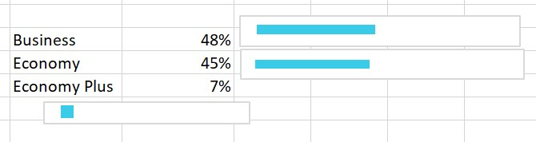
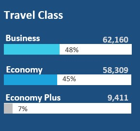
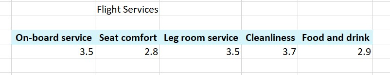
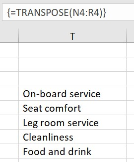
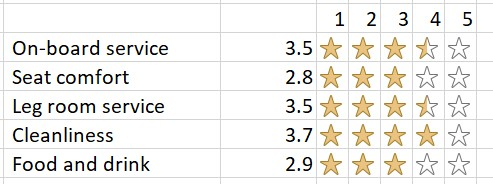
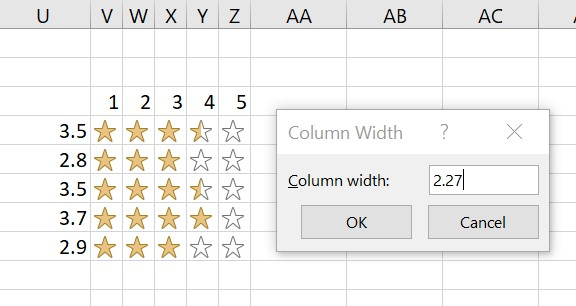
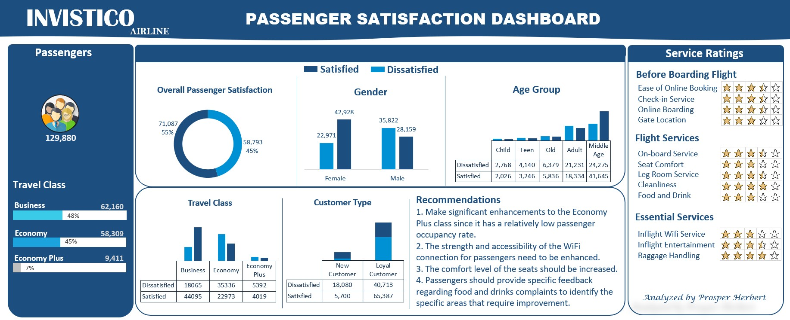

# Invistico_Airline_Analysis

## Introduction
This is a microsoft excel project on customer satisfaction for an airline called **Invistico Airline**. 
This project was done to analyze the data and derive actionable insights and help the airline make data driven decisions.

**_Disclaimer_**: _The actual name of the company is not given due to various purposes hence the name **_Invistico Airline._**_

## Problem Statement
1. Percentage of satisfied customers?
2. What aspect of the services offered have to be emphasized more to generate more satisfied customers?
3. Will new customers be satisfied and return?
4. Customer satisfaction based on a certain criteria.

## Microsoft excel features incorporated:
- Pivot tables
- Pivot charts
- Excel formulas
- Conditional formatting

## Analysis and Visualization
### Data Sourcing
This dataset was gotten from [Kaggle.com](https://www.kaggle.com/datasets/sjleshrac/airlines-customer-satisfaction).
### Data Cleaning
- The main dataset was first duplicated so in case of any irreversible error, there would always be something to fall back to.
- All columns were set to the accurate data type.
- Checked for duplicates and blanks and deleted the two columns with the most and only blank cells.
- Then I put the data into a table.
### Visualization using Pivot Tables and Charts
1. Total passengers.

This was calculated by the sum of the male and female passengers and represented using a Text Box.

2. Total passengers by travel class.

This was calculated seperately for each class and visualized using the Recommended Chart feature.

Calculation | Visualization
:----------:|:-------------:
|

3. Overall passenger satisfaction.

This was done using a Pivot Table to get the Satisfaction and Count of Satisfaction. Represented with a Doughnut chart.

4. Customer satisfaction by Gender, Age Group, Travel Class, and Customer Type.

All were calculated with Pivot Tables and represented using Column Charts.

5. Service Ratings.

Used Pivot Table to get the data, then `=TRANSPOSE(N4:R4)` to arrange them vertically.

Pivot Table | Transposed data
:----------:|:--------------:
|

Then I used this `=IF($U4>=V$3,1,IF(INT($U4)=V$3-1,MOD($U4,1),0))` to get the average of ratings from 1-5, then and **conditional formatting** to represent that average using stars.

While sending all the visuals to the Dashboard sheet, I highlighted the columns containing the stars and reduced their column width to 2.27.

Then I copied only the cells containing the stars and pasted as "linked picture" in the Dashboard sheet. So any adjustment I make will reflect on the image.

## Dashboard
This is the finished work. 

I'm so proud of myself 😁

### Insight and Recommendation
Although a greater percentage of customers expressed satisfaction, based on the dashboard data, it is evident that a significant portion of the recent customers expressed dissatisfaction and are unlikely to return. Therefore, it is crucial for this company to take into account the recommendations and strive to enhance their services in order to provide a better customer experience for all.

